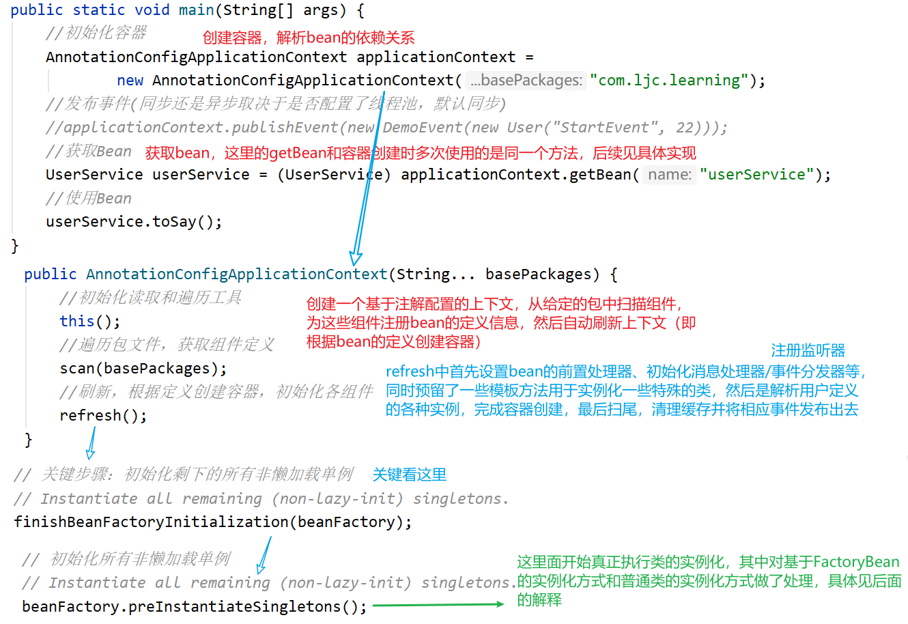
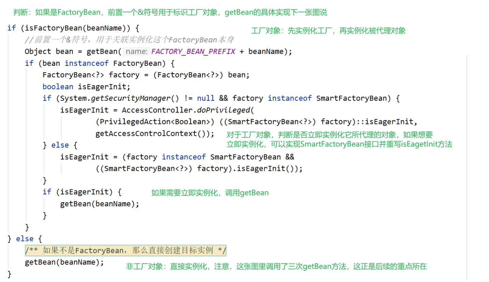
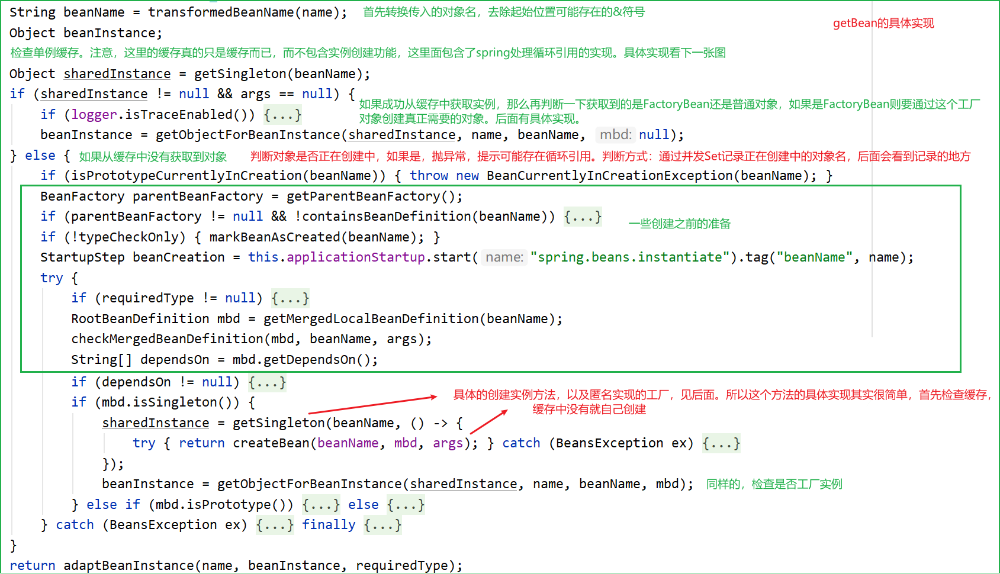
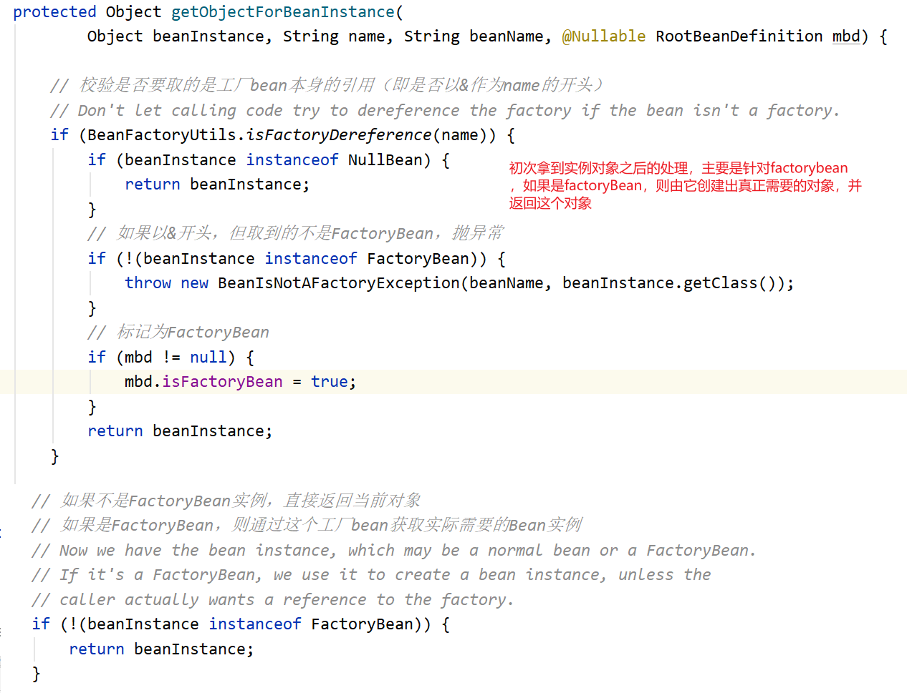
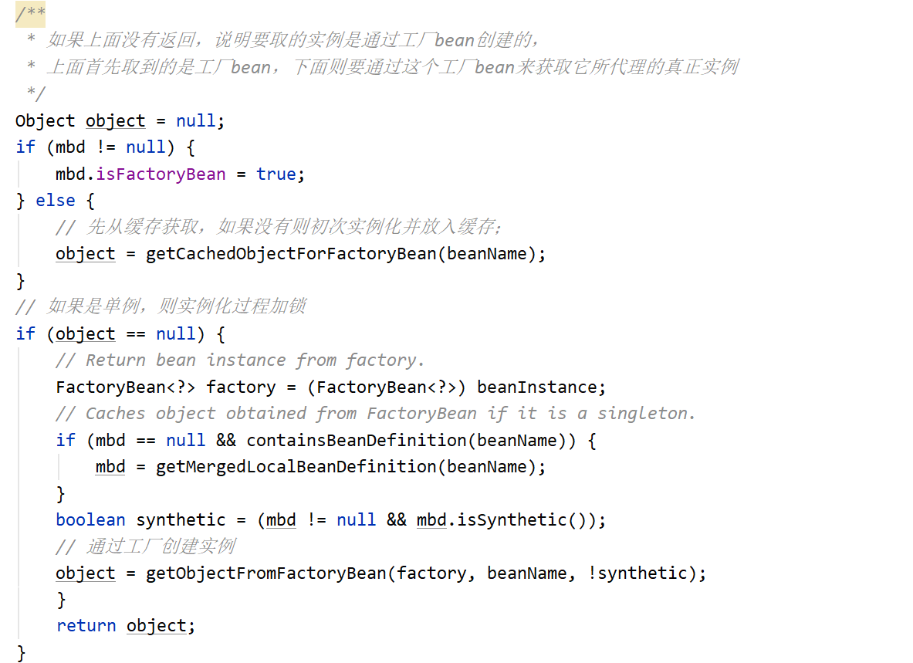
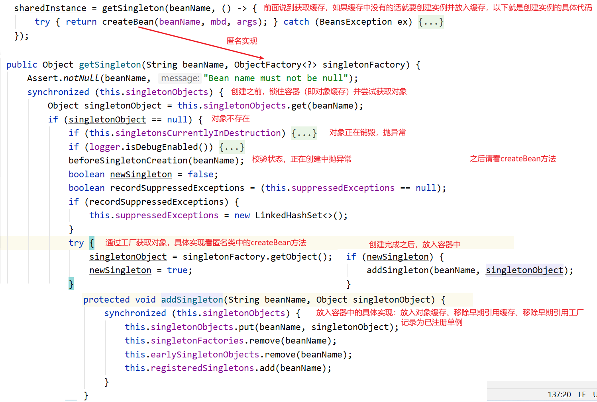
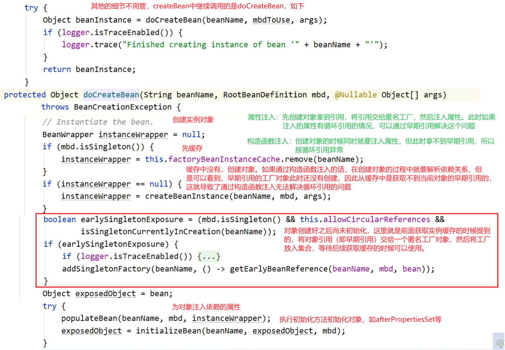
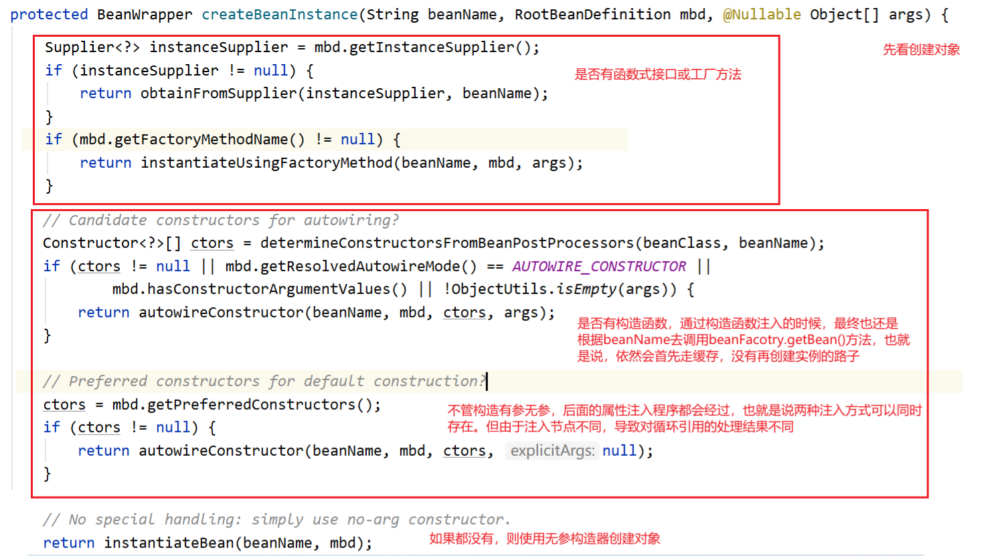
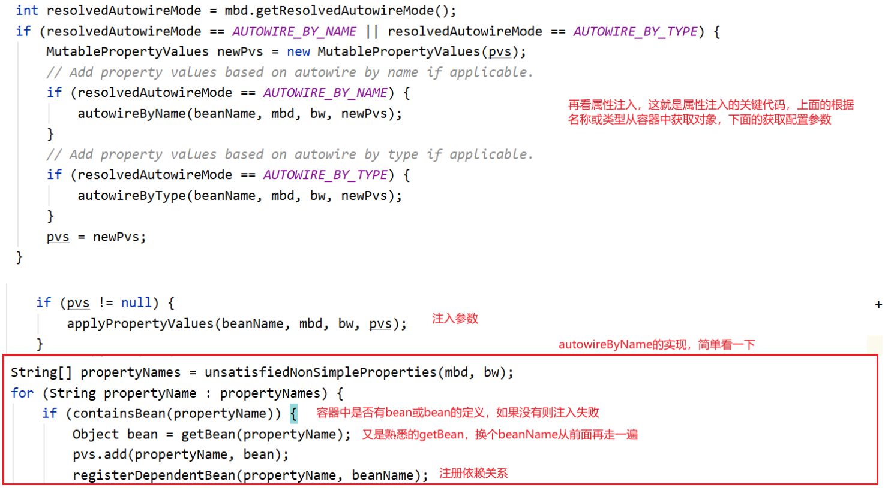

# IOC
本文描述了Spring核心IOC容器的创建过程。重点关注Spring的架构、依赖关系解析及循环引用的解决办法。

## Spring架构

### 设计模式

模板方法、单例

### BeanFactory
* BeanFactory  
   	BeanFactory是IOC容器的顶层接口，提供了IOC容器最基本的形式，给具体的IOC容器实现提供了规范。  
   	    原始的BeanFactory无法支持spring的许多插件，如AOP功能、Web应用等。  
   	    如XMLBeanFactory就是一种典型的BeanFactory。  
   	常用的ApplicationContext接口就由BeanFactory接口派生而来，ApplicationContext包含BeanFactory的所有功能，并有所扩展。
* FactoryBean  
 		FactoryBean定义了一个能<生产或者修饰对象>的工厂Bean，用于为IOC容器中Bean的实现提供更加灵活的方式，
 	可以创建更复杂的实例。  
 	    FactoryBean在IOC容器的基础上给Bean的实现加上了一个简单工厂模式和装饰模式，可以在getObject()方法中灵活
 	配置。在Spring源码中有很多FactoryBean的实现类。  
 		一般情况下，Spring通过反射机制利用<bean>的class属性指定实现类实例化Bean，在某些情况下，实例化Bean过
 	程比较复杂，如果按照传统的方式，则需要在<bean>中提供大量的配置信息。配置方式的灵活性是受限的，这时采用编
 	码的方式可能会得到一个简单的方案。Spring为此提供了一个org.springframework.bean.factory.FactoryBean的
 	工厂类接口，用户可以通过实现该接口定制实例化Bean的逻辑。FactoryBean接口对于Spring框架来说占用重要的地位，
 	Spring自身就提供了70多个FactoryBean的实现。它们隐藏了实例化一些复杂Bean的细节，给上层应用带来了便利。从
 	Spring3.0开始，FactoryBean开始支持泛型，即接口声明改为FactoryBean<T>的形式  
 		以Bean结尾，表示它是一个Bean，不同于普通Bean的是：它是实现了FactoryBean<T>接口的Bean，根据该Bean的
 	ID从BeanFactory中获取的实际上是FactoryBean的getObject()返回的对象，而不是FactoryBean本身，如果要获取
    FactoryBean对象，请在id前面加一个&符号来获取。

## 主要流程
### 程序入口

### 创建容器
对FactoryBean有一些额外处理  

### 万能的getBean
无论哪种类型，都是通过getBean来创建实例（或获取）
  
二次处理：对FactoryBean，第一次获取到的是FactoryBean本身，如果beanName加了&则直接返回此对象，  
如果不加&则由工厂对象创建真正的目标对象后返回（同样加了缓存）。所以通过对象名永远获取到的是依赖的对象本身：  
  

### getBean的缓存
如上，getBean的逻辑就是先找缓存，找不到就初始化之后再存入缓存，下面先看缓存  

### getBean的实例初始化主流程

### 实例初始化的具体工作（由匿名工厂实现）

创建对象和注入依赖的具体实现见下
### 创建对象

### 注入依赖
