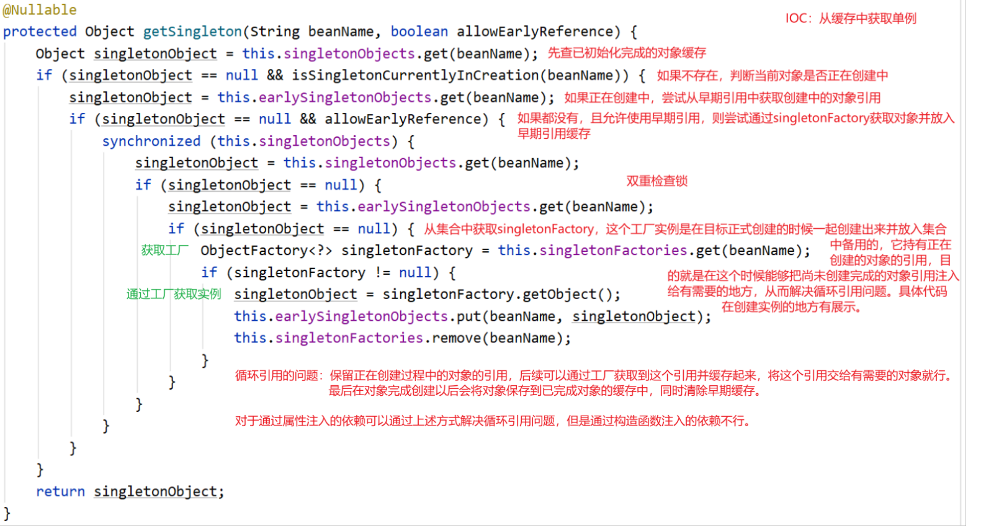

# IOC
本文描述了Spring核心IOC容器的创建过程。重点关注Spring的架构、依赖关系解析及循环引用的解决办法。

## 主要流程
### 程序入口

### 创建容器
对FactoryBean有一些额外处理  

### 万能的getBean
无论哪种类型，都是通过getBean来创建实例（或获取）
  
对factoryBean对象会再校验一次，并由工厂对象创建真正的目标对象（同样加了缓存）：  
  

### getBean的缓存
如上，getBean的逻辑就是先找缓存，找不到就初始化之后再存入缓存，下面先看缓存  

### getBean的实例初始化主流程

### 实例初始化的具体工作（由匿名工厂实现）

创建对象和注入依赖的具体实现见下
### 创建对象

### 注入依赖
